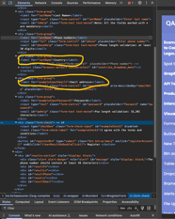
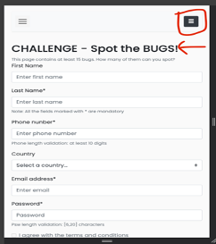

These are some of the Automation tests for Spot The Bug challenge.

List-of-Bugs-on-Register-Page.docx contains the list of bugs.

## List of Bugs on Register Page

## Form Validation Bugs
1.	Open form and click register button without filling any data. Only password field error is displayed. 
Error should be displayed for all missing fields.
2.	Label element’s “for” attribute doesn’t match the “id” attribute of the corresponding input field. This might prevent the accessibility tools from working correctly.

3.	Form fields are missing Autocomplete attribute. Providing this can enhance user experience.
4.	Last name field missing mandatory field validation.
5.	On successful registration the result section data for last name field truncates the last character.
6.	Phone number field missing type validation. Accepts non-numeric characters.
7.	On successful registration the result section data for phone number field doesn’t match the input value. 
a.	Last digit is truncated and is increment by one then concatenated with the first 9 digits and displayed in information field.
b.	If last digit is not a number then first 9 digits(or characters since it is missing a validation for non-numeric characters) are concatenated with “NaN”.
8.	On successful registration the result section data for country field is showing default value “Select a country…" when no value is selected from dropdown.
9.	Email address field 
a.	missing mandatory field validation 
b.	email format validation. 
c.	Also aria-describedby attribute is defined but help text is not provided.
10.	Terms and conditions checkbox 
a.	missing mandatory field validation. 
b.	field is disabled.
11.	User can register with only phone number and password. Bypassing other required fields. This should be blocked.
12.	Successful registration should clear the form fields.

## UI Bugs
13.	 "X" button in header appears out of place.
14.	 Inconsistent spacing between fields.
15.	 "Note: All the fields marked with * are mandatory" text should be displayed before first field on the form.
16.	 Typos in form field labels.
17.	 Inconsistent field label formatting. Some fields labels are Camel Case other are Title case have second word.
18.	 Country dropdown field icon should be a down arrow.
19.	 Phone number field length hint should be a tool tip displayed on hover.
20.	 Password field length hint can be a tool tip. Also a typo in hint text. It should be “Password length validation: 6-20 characters. 
21.	Password field placeholder should be “Enter Password” to keep it consistent with placeholders of other fields.
22.	 Email field placeholder should be "Enter email address" to keep it consistent with other fields.

## Mobile View
23.	 Heading should resize dynamically as per mobile view size.
24.	 Country field list items font too small in mobile view. 
25.	 Home and Contact header fields change to hamburger icon in mobile view resulting in two menu icons.

## To run the tests on local follow the steps.
1. Clone the repository
2. cd into repo folder
3. npm run install
4. npm test or npm run test:user-registration for running user registration tests
